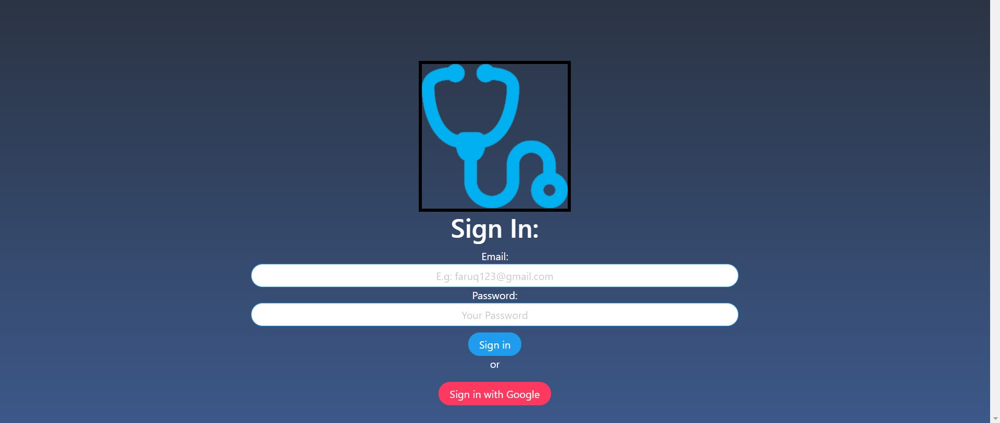
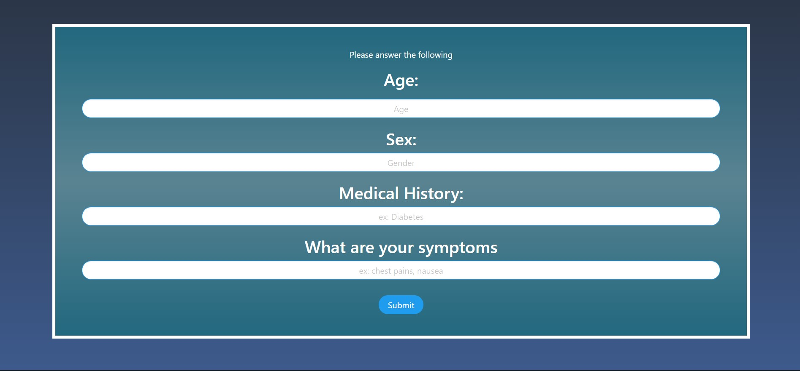
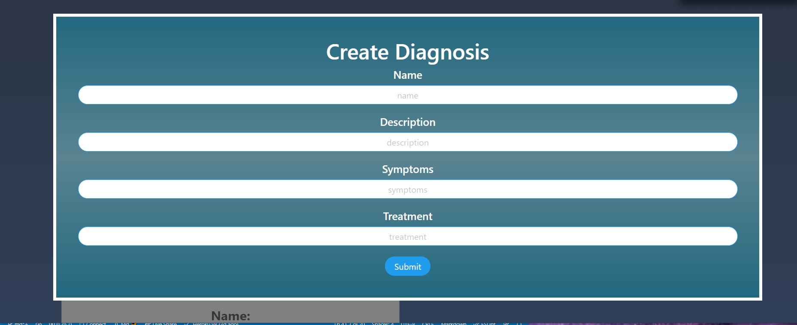

# OnlySyms : MedApp:

* This app is a React-based Symptoms App. Its made with the funtionality of MERN. The application has 5 pages that contains the follwing:

* 1. The Login page(Auth) - The user will be able to login in or signup to signin to enter the application . The user also able to login with the google account ...

* 2. The Info Page: After Login- in the Info page the user can put some info as Name, Sex, Medical history and Symptoms and submit it . The Information will be add into the Mongo Database and save obiously. 

* 3. The profile Page : A profile will be created in profile page for the user .

* 4. The Result Page: The user can check the result of the symptoms in Result page directly. The user will be able to see their results and save it instatly .

* 5. The Create Diagnosis Page(Crud) : The user will be able to create diagnosis for him/herself and save for future references.. 

## Usage / Directions
* Click the link to check! ==> https://.herokuapp.com/

## LOGIN PAGE:
* 

 

## INFO PAGE:
* 

 
    
    
## PROFILE PAGE:
*  

 
 
    
## RESULT PAGE:
*  

 

    
## CREATE DIAGNOSIS PAGE:
*  

 
## Walk Through the Video

## Tools Used / Dependancies
--
* React
* react-router-dom
* Third Party Hooks
* Axios
* Bulma CSS [NewPackage]
* Mongo DB
* Mongoose
* Express
* Bootstrap
* JS
* Github
* Heroku

## Links
* APP: https://herokuapp.com/
* REPO: https://github.com/brc9087/medapp
